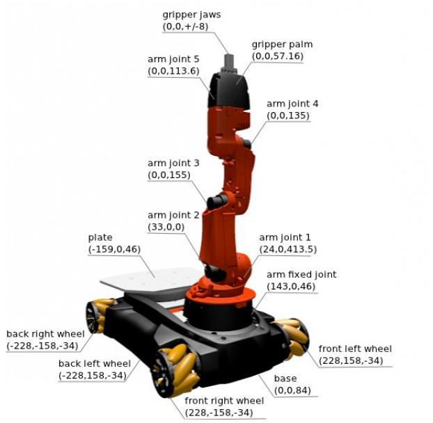

# Пример написания узлов для управления мобильной платформой и манипулятором

В данном документе представлена инструкция по написанию программного обеспечения для платформы KUKA youBot.

Для работы потребуется создать пакет, где будут храниться исходники файлов.

Откройте рабочую область и создайте пакет с необходимыми зависимостями:

```console
cd ~/catkin_ws/src/
catkin_create_pkg youbot_control geometry_msgs roscpp brics_actuator pr2_msgs std_msgs youbot_driver
```
 
Пакет готов для написания кода.


##  Пример написания узлов управления

Рассмотрим пример написания узла управления скорости. Благодаря модульности ROS данная реализация подойдет и к другим мобильным платформам.

Создайте c++ файл:

```console
cd ~/catkin_ws/src/youbot_control/src
touch velocity_control.cpp
```

Скопируйте следующий код:

```cpp
#include <ros/ros.h>
#include <geometry_msgs/Twist.h> 

#include <stdlib.h> 

int main(int argc, char **argv) {
    //Инициализирует ROS и настраивает узел
    ros::init(argc, argv, "velocity_control");
    ros::NodeHandle nh;

    //Создает издателя для передачи
    ros::Publisher pub
    pub = nh.advertise<geometry_msgs::Twist>("cmd_vel", 1);

    double vx = 0.0
    double vy = 0.0
    double th = 0.0

    //Sets the loop to publish at a rate of 10Hz
    ros::Rate rate(10);


    while(ros::ok()) {

        cout << "Please type value of vx" << endl;
        cin >> vx
        cout << "Please type value of vy" << endl;
        cin >> vy;
        cout << "Please type value of th" << endl;
        cin >> th;

        //Создание сообщения для отправки
        geometry_msgs::Twist msg;
        msg.linear.x = vx;
        msg.linear.y = vy;
        msg.angular.z = th;

        //Отправка сообщения
        pub.publish(msg);

        //Задержка, пока не пришло время отправить другое сообщение
        rate.sleep();
        }
}
```

Компиляция в ROS выполняется системой сборки catkin. Первым шагом обычно является установка зависимостей наших пакетов в CMakeLists.txt и package.xml. Однако это уже было сделано для нас, когда мы создали пакет и указали наши зависимости. Следующим шагом будет объявление нашего нового узла как исполняемого файла, это делается путем добавления следующих двух строк в файл CMakeLists.txt расположенный в ~/catkin_ws/src/youbot_control/

```cmake
add_executable(velocity_control src/velocity_control.cpp)
target_link_libraries(velocity_control ${catkin_LIBRARIES})
```

Для упрвления манипулятором вам необходимо задавать положения каждого сочленения в радианах, а для захвата в метрах.





Если манипулятор KUKA youBot эксплуатируется без мобильной платформы, базовая рама манипулятора является исходной рамой. В этом случае его относительное положение XYZ равно «0,0,0». Если манипулятор установлен на мобильной платформе, базовая рама манипулятор представляет собой преобразование координат по отношению к базовой раме мобильной платформы.


```text
arm joint 1
Parent joint = “arm base frame”;
Relative positionXYZ = “24mm 0mm 115mm”;
OrientationZYX = “0° 0° 180°”;
Joint limits = “-169° 169°”;

arm joint 2
Parent joint = “arm joint 1”;
Relative positionXYZ = “33mm 0mm 0mm”;
Orientation ZYX = “-90° 0° 90°”;
Joint limits = “-65° 90°”;

arm joint 3
Parent joint = “arm joint 2”;
Relative positionXYZ = “155mm 0mm 0mm”;
OrientationZYX = “-90° 0° 0°”;
Joint limits = “-151° 146°”;

arm joint 4
Parent joint = “arm joint 3”;
Relative positionXYZ = “0mm 135mm 0mm”;
OrientationZYX = “0° 0° 0°”;
Joint limits = “-102.5° 102.5°”;

arm joint 5
Parent joint = “arm joint 4”;
Relative positionXYZ = “0mm 113.6mm 0mm”;
OrientationZYX = “0° 0° -90°”;
Joint limits = “-165° 165°”;


gripper base frame
Parent joint = “arm joint 5”;
Relative position = “0mm 0mm 57.16mm”;
OrientationZYX = “180° 0° 0°”;

gripper left finger joint
Parent joint = “gripper base frame”;
Relative position = “0mm 8.2mm 0mm”;
Joint limits = “0mm 12.5mm”;


gripper right finger joint
Parent joint = “gripper base frame”;
Relative position = “0mm -8.2mm 0mm”;
Joint limits = “0mm 12.5mm”;
```

Аналогичным способом создаем узел управления положением манипулятора, создав фаил исходника и скопировав в него код:

```console
cd ~/catkin_ws/src/youbot_control/src
touch manipulator_control.cpp
```

```cpp
#include <iostream>
#include <assert.h>

#include "ros/ros.h"
#include "trajectory_msgs/JointTrajectory.h"
#include "brics_actuator/CartesianWrench.h"

#include <boost/units/io.hpp>

#include <boost/units/systems/angle/degrees.hpp>
#include <boost/units/conversion.hpp>

#include <iostream>
#include <assert.h>

#include "ros/ros.h"
#include "brics_actuator/JointPositions.h"

#include <boost/units/systems/si/length.hpp>
#include <boost/units/systems/si/plane_angle.hpp>
#include <boost/units/io.hpp>

#include <boost/units/systems/angle/degrees.hpp>
#include <boost/units/conversion.hpp>

using namespace std;

int main(int argc, char **argv) {

    //Инициализирует ROS и настраивает узел
	ros::init(argc, argv, "manipulator_control");
	ros::NodeHandle n;

    //Создает издателя для манипулятора и захвата
	ros::Publisher armPositionsPublisher;
	ros::Publisher gripperPositionPublisher;
    
    //Передает издателю тип сообщения и тему для публикации 
	armPositionsPublisher = n.advertise<brics_actuator::JointPositions > ("arm_1/arm_controller/position_command", 1);
	gripperPositionPublisher = n.advertise<brics_actuator::JointPositions > ("arm_1/gripper_controller/position_command", 1);

	ros::Rate rate(20); //Hz
	double readValue;
    //Количество сочленений
	static const int numberOfArmJoints = 5;
	static const int numberOfGripperJoints = 2;
	while (n.ok()) {

        //Создание сообщения
		brics_actuator::JointPositions command;
		vector <brics_actuator::JointValue> armJointPositions;
		vector <brics_actuator::JointValue> gripperJointPositions;

		armJointPositions.resize(numberOfArmJoints); 
		gripperJointPositions.resize(numberOfGripperJoints);

		std::stringstream jointName;

		//Реализация последовательного ввода положения в радианах для каждого сочленения манипулятора
		for (int i = 0; i < numberOfArmJoints; ++i) {
			cout << "Please type in value for joint " << i + 1 << endl;
			cin >> readValue;

			jointName.str("");
			jointName << "arm_joint_" << (i + 1);

			armJointPositions[i].joint_uri = jointName.str();
			armJointPositions[i].value = readValue;

			armJointPositions[i].unit = boost::units::to_string(boost::units::si::radians);
			cout << "Joint " << armJointPositions[i].joint_uri << " = " << armJointPositions[i].value << " " << armJointPositions[i].unit << endl;

		};

        //Реализация последовательного ввода положения в метрах для захвата
		cout << "Please type in value for a left jaw of the gripper " << endl;
		cin >> readValue;
		gripperJointPositions[0].joint_uri = "gripper_finger_joint_l";
		gripperJointPositions[0].value = readValue;
		gripperJointPositions[0].unit = boost::units::to_string(boost::units::si::meter);
		cout << "Please type in value for a right jaw of the gripper " << endl;
		cin >> readValue;
		gripperJointPositions[1].joint_uri = "gripper_finger_joint_r";
		gripperJointPositions[1].value = readValue;
		gripperJointPositions[1].unit = boost::units::to_string(boost::units::si::meter);
        
        //Отправка команд в соответствующие топики
		cout << "sending command ..." << endl;
    
		command.positions = armJointPositions;
		armPositionsPublisher.publish(command);

		command.positions = gripperJointPositions;
		gripperPositionPublisher.publish(command);

        //Завершение цикла
		cout << "--------------------" << endl;
		ros::spinOnce();
		rate.sleep();
	}

	return 0;
}
```

По аналогии добавим данный файл в систему сборки добавив следующие строки в CMakeLists.txt, расположенного в пакете youbot_control

```cmake
add_executable(manipulator_control src/manipulator_control.cpp)
target_link_libraries(manipulator_control ${catkin_LIBRARIES})
```

Для запуска узлов необходимо заново собрать рабочую область

```console
cd ~/catkin_ws
catkin_make
```

Теперь узлы готовы к работе с платформой. 

Запустите робота командой в терминале:

```console
roslaunch youbot_driver_ros_interface youbot_driver.launch
```

В новом окне терминала запустите узел управления скоростью:

```console
rosrun youbot_driver_ros_interface velocity_control
```

В новом окне терминала запустите узел управления манипулятором:

```console
rosrun youbot_driver_ros_interface manipulator_control
```

Проверьте работу запущенных узлов последовательно введя скорости и значения положения для манипулятора в соответствующие окна терминала.

Для остановки работы узла в соответствующие окне терминала нажмите сочетание клавиш  `Ctrl + C`